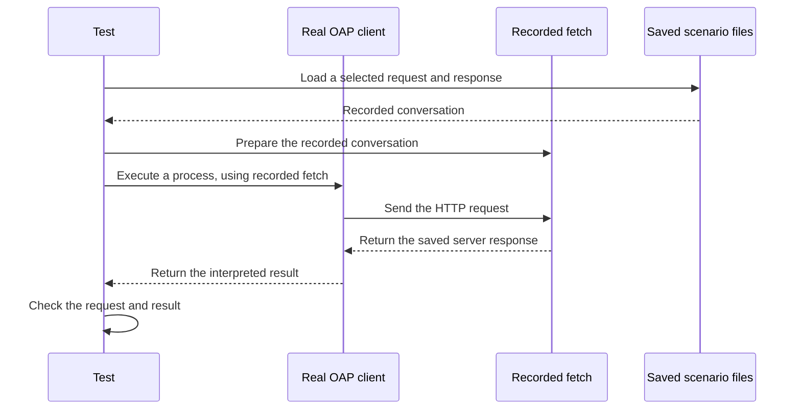

# Understanding the recorded client tests

This guide explains the test suite without assuming experience with automated
testing. For the technical details and rules for adding tests, see the
[test suite guide](client-fixture-handoff.md).

## What are we testing?

We test the **real OAP client library** against saved conversations with OGC API
Processes servers, including ZOO, pygeoapi and Weaver.

The question is: **does the client send the expected request and correctly
understand a response like the ones we have observed in practice?**

The suite currently installs `@breinstein/oap-client` version `0.3.2` from npm,
the package registry. By default it does not use the neighbouring `oap-client` folder. Editing that
folder will not change the default test results. Testing a newer published
release requires updating the dependency and lockfile.

There is also an explicit `npm run check:local` command to test a build from
that neighbouring folder. It prints which client it uses and leaves the
published package installed. You must build the client first, and rebuild
after source changes; see the [local build instructions](client-fixture-handoff.md#test-a-local-client-build).

## What is the fake transporter?

A transport is the part that carries a request to a server and brings back a
reply. The client normally uses a function called `fetch` to do that.

The client already lets callers supply a replacement `fetch`. Our tests use
that option to supply a small function called `recordedFetch`. This is what we
mean by the **fake transporter**: it supplies a saved reply instead of making
an internet request.



No API server starts up, and no process actually runs on ZOO, pygeoapi or
Weaver. The real client still builds its request, reads the reply and decides
whether it received a result, an accepted job or an error.

The helper checks the request's address and method (such as `GET` or `POST`)
against the selected recording. It returns the saved status, headers and body
in a standard HTTP response object. For a sequence of requests, it supplies
the selected replies in order. Extra requests, wrong addresses and unused
recordings cause the checks to fail.

It does not calculate results or decide whether a provider would accept an
input. It also does not automatically compare every outgoing header and body;
the individual tests make those checks explicitly.

## One concrete example: saying hello

The simplest ZOO recording contains a request to execute `hellojs` with the
name `Codex`, followed by a successful response containing
`Hello Codex from the JS World !`.

The test in [execution.test.ts](../tests/protocol/execution.test.ts):

1. Reads that request and response from `scenarios/`.
2. Gives the saved reply to the fake transporter.
3. Calls the real client's `execute` function with the recorded inputs and
   the replacement `fetch`.
4. Checks that the client sent the expected JSON and relevant headers.
5. Checks that the client recognised an immediate result and preserved the
   returned response body.

If the client started dropping an input or treating this reply as a background
job, this test would fail. It does not check that ZOO can still execute
`hellojs` today: that would require a separate live server test.

## What are all the TypeScript files for?

A `.ts` file contains TypeScript code. Here, these files describe the test steps
and checks, or provide the small amount of support needed to run them.
`*.test.ts` means a file contains tests. Vitest is the program that finds those
tests, runs them and reports which passed or failed.

There are currently **24 tests: 19 exercise the real client and five check the
recording helper**. Some files run the same check against multiple recordings,
so the number of files is smaller than the number of tests.

| File | What it does in plain language |
|---|---|
| [discovery.test.ts](../tests/protocol/discovery.test.ts) | Checks that the real client follows saved discovery replies and returns the process list. |
| [descriptions.test.ts](../tests/protocol/descriptions.test.ts) | Passes saved descriptions directly to the real client's parser and checks that input and output definitions survive. These two tests do not need a transporter. |
| [execution.test.ts](../tests/protocol/execution.test.ts) | Checks execution requests and immediate results using ZOO, pygeoapi and Weaver recordings. |
| [errors.test.ts](../tests/protocol/errors.test.ts) | Checks that the client reports both a structured error and an HTML error page while keeping the server's error information available. An expected error means the test passes. |
| [submission.test.ts](../tests/protocol/submission.test.ts) | Checks that an accepted background job returns its ID and status address. These tests stop there; they do not wait for completion. |
| [jobs.test.ts](../tests/protocol/jobs.test.ts) | Runs recorded successful jobs through the real client, from submission to status checks and results. Also checks failed jobs, results requested too early, dismissal, missing jobs and repeated dismissal. |
| [recorded-fetch.ts](../tests/support/recorded-fetch.ts) | Loads selected recordings and provides the replacement fetch function. This is the fake transporter itself. |
| [recorded-fetch.test.ts](../tests/support/recorded-fetch.test.ts) | Checks the helper directly: incorrect requests must fail, replies must remain readable, and saved body files must load correctly. These five tests protect the test setup. |
| [setup.ts](../tests/setup.ts) | Blocks the normal global fetch during tests, so an accidental attempt to use it fails instead of contacting a server. |
| [vitest.config.ts](../vitest.config.ts) | Tells Vitest where the tests are and which setup file to use. |

The other new configuration files have supporting roles:

| File | Purpose |
|---|---|
| [check_local_client.py](../scripts/check_local_client.py) | Optional Python launcher that selects a built local client for both type checking and tests, without installing it. |
| [package.json](../package.json) | Lists the client and tools to install, plus commands such as `npm test`. |
| [package-lock.json](../package-lock.json) | Records exact dependency versions so colleagues and CI install the same packages. Its size does not represent custom test code. |
| [tsconfig.json](../tsconfig.json) | Configures TypeScript's checks for mistakes such as passing the wrong kind of value to a function. |
| [test.yml](../.github/workflows/test.yml) | Tells GitHub Actions to install dependencies and run the checks on pushes and pull requests, or when started manually. |

## Where do the expected answers come from?

The existing JSON files remain the evidence. A **fixture** simply means saved
data used by a test. `scenarios/` selects representative conversations;
`evidence/` holds the larger collection of captures and their provenance.

A request file records what was sent to the provider. A response file records
what came back, including the status, headers, final address and body. Where a
response refers to a separate `body_file`, the helper reads that file too.
Placeholders such as `{{baseUrl}}` receive fixed values chosen by the test.
Even when a recording contains a real internet address, the injected fetch
handles the request locally.

The TypeScript tests contain the **assertions**: statements such as “the result
must be immediate” or “these input definitions must be preserved.” There is no
separate machine-readable specification of expected behaviour.

A recorded request and the current client's request can legitimately differ.
For example, the client may use a different `Accept` header. Such differences
are visible in the tests; the helper does not silently rewrite the client's
request to match a provider.

## Try it yourself

Open a terminal in this repository. You need Node 24 or later.

```bash
cd ~/projects/geonovum-tender/ogc-processes-tests
npm ci
npm test -- --reporter=verbose
```

`npm ci` installs the exact packages from the lockfile and requires access to
the package registry. Run it when first setting up or after dependency changes.
The tests themselves use local recordings and do not need running providers.

To run only the hello example:

```bash
npm test -- tests/protocol/execution.test.ts -t "ZOO:" --reporter=verbose
```

To read its saved conversation:

```bash
cat scenarios/protocol/execution/zoo-local/simple-sync/01-execute.request.json
cat scenarios/protocol/execution/zoo-local/simple-sync/01-execute.response.json
```

To run the same checks configured for GitHub Actions:

```bash
npm run check
```

This checks the TypeScript code and then runs the tests. The verbose output
shows test names and pass/fail results; it does not print every HTTP request
and reply as they pass through.

## What does a green result tell us?

It tells us that the installed client version passed the specific checks
written for these recordings. This is useful when upgrading the client: we
can rerun the same conversations and spot behaviour that has changed.

It does not establish that every OGC server works with the client, or that a
live server would accept every request. The saved reply is supplied once the
expected method and address match, regardless of how a live server might
respond to the body. The tests separately check selected request details.

Job polling now uses the client's own loop: the ZOO recording reports running
and then successful; Weaver has only a successful status reply recorded. The
client then fetches the result document. A separate test asks the client to
dismiss a job and checks the recorded dismissal reply. Further checks cover
reading a missing job and trying to dismiss the same job again. These tests
do not simulate work being performed on a server.

A missing job has different meanings to different client calls: `getJob`
reports a missing-job error; `pollJob` stops waiting with the outcome
`dismissed-remotely`; a repeated `dismissJob` reports the server's 404 error.
The tests check that distinction. The label `dismissed-remotely` does not by
itself prove who removed the job or why it is missing.

To run just these eight job tests:

```bash
npm test -- tests/protocol/jobs.test.ts --reporter=verbose
```

The suite does not yet test cancelling a local wait, job listing, generated
forms, map/table rendering, browser network permissions (CORS), or the current
availability of providers. The large CSV helper test checks loading recorded
bytes, not displaying a table.

GitHub Actions automates these same checks once the workflow is pushed to
GitHub. It tests the pinned client release; changes in the separate client
repository do not automatically trigger this suite or update that release.
